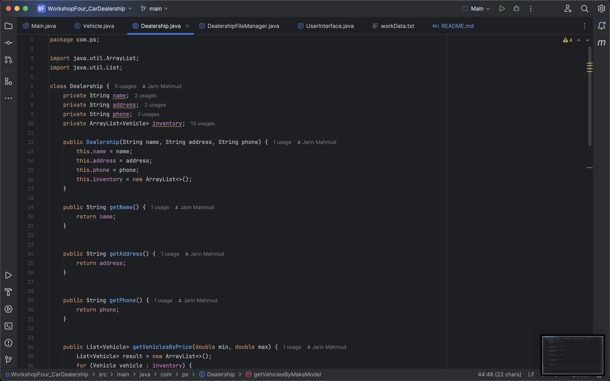

## Car Dealership CLI Application
## Purpose:
Store and remove car data and filter by elements.

## Planning chart:
The project code will follow the outline attached below:

| Main and constructor class                  | Screen Classes     | Method Classes             | Other Files  |
|---------------------------------------------|--------------------|----------------------------|--------------|
| Main.java                                   | UserInterface.java | DealershipFileManager.java | workData.txt |
| Vehicle.java                                |                    |                            | Readme.md    |
| Dealership.java  (also has working methods) |                    |                            |              |

## Understanding Class Functions:
Main.java: Main class to call methods.  
Vehicle.java: Contains constructor, getters and setters for vehicle.  
Dealership.java: Contains constructor, getters and setters for dealership.  
UserInterface.java: Contains code of displaying screen prompt and process all prompt request.  
DealershipFileManager.java: Contains code of read and save from/to the data file.  
Readme.md: Contains project details.

## Code Snippets:

### Main.java:

### Vehicle.java:

### Dealership.java:

### UserInterface.java:

### DealershipFileManager.java:

### workData.txt:

### Interesting Code:

This code was interesting to write because figuring out the position value of the inputs. Which should be written after % for scan, varying that and figuring out was simple yet interesting.

## Sample Input and Output:
### Displaying home Screen:

### All Car display Screen:

### Filter by Price Range Screen:

### Filter by Make/Model Screen:

### Filter by Year Screen:

### Filter by Color Screen:

### Filter by mileage Screen:

### Filter by type (here SUV) Screen:

### Error Screen:

The project met all the requirements described on project requirements (workshop 4 project file). Despite, it can be polished further for better usage.

Project done by JARIN MAHMUD

### ----- End of Readme -----

